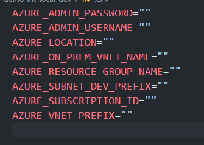

# 
All in Powershell in admin mode

Install-Script winget-install -Force
winget-install


code --list-extensions > extensions.list
cat extensions.list |% { code --install-extension $_}

# Introduction

The purpose of this repository is to create a local development environment for developping Azure Integration. This is to be sure you are using a fresh machine with the minimal setup in place, a better alternative will be to use Azure DevBox, but for simplicity of the demo a normal virtual machine will be created. 

The OS used is Windows Server and all development is using Visual Studio Code.

# Prerequisites

- Fork this repository
- Install [Azure Developer CLI](https://learn.microsoft.com/en-us/azure/developer/azure-developer-cli/overview)
- Install [Azure CLI](https://learn.microsoft.com/en-us/cli/azure/install-azure-cli)

# Create the virtual machine

First, you need to login to Azure using the Azure CLI.

```bash
az login
```
Once you login, you can create the infrastructure using the following command.

Now you will need to create a folder inside the cloned repository to have the proper configuration needed for the Bicep template.

Run this command

```bash
cd <forker_repository>
mkdir .azure/demo-int-local-dev
```

Once is done create a file named **.env**

The file needs to have those values



Here the definition of each variable

| Variable | Definition |
| -------- | ---------- |
| AZURE_ADMIN_PASSWORD | The password for the local admin account of the VM |
| AZURE_ADMIN_USERNAME | The username for the local admin account of the VM |
| AZURE_LOCATION | The location where the resources will be created |
| AZURE_ON_PREM_VNET_NAME | The name of the on-premises virtual network |
| AZURE_RESOURCE_GROUP_NAME | The name of the resource group where the resources will be created |
| AZURE_SUBNET_DEV_PREFIX | The address prefix of the subnet for the development environment |
| AZURE_SUBSCRIPTION_ID | The subscription id where the resources will be created |
| AZURE_VNET_PREFIX | The address prefix of the virtual network |

Now you can go to the Azure Portal and connect to the virtual machine.

# Install software in the virtual machine

For installing all the software we will use winget, this is a package manager for Windows.

First, we need to install winget.

Open a Powershell terminal in administrator mode and run the following command.

```powershell
Install-Script winget-install -Force
winget-install
```

Now create a file in the terminal called wingetpackage.json.
```powershell
New-Item -Path wingetpackage.json -ItemType File
notepad wingetpackage.json
```

Now, you need to install Nodejs, seems winget cause problem to install this software sometimes.  Go to the [NodeJS](https://nodejs.org/en) website and download the LTS version.

Once is installed you need to install the Azure Storage Emulator

```powershell
npm install -g azurite
```

In the GitHub repository you will have a file with the same name under the directory **softwares**.  Copy the content of it in the file created in the virtual machine.

Once is done, run the following command.

```powershell
winget import -i .\wingetpackage.json
```

If any time you add more software using Winget and want to save the list of software installed, you can run the following command.

```powershell
winget export -o wingetpackage.json
```

Another important software to install is the ServiceBusExplorer that you can get at this [link](https://github.com/paolosalvatori/ServiceBusExplorer)

Finally, if you need to do infrastructure as code you can install Bicep

```powershell
winget install -e --id Microsoft.Bicep
```

# Install Visual Studio Code extensions

Now you need to install the visual studio code extensions.  To do that you need to run the following command.

```powershell
New-Item -Path extensions.list -ItemType File
notepad .\extensions.list
```

Just copy all the extensions you have in the file in the GitHub repository under extensions.list

Once is done, run the following command.

```powershell
cat extensions.list |% { code --install-extension $_}
```

# Configure Nuget

Go to the directory **%appdata%\NuGet\** and from there run this command line

```powershell
dotnet nuget add source https://api.nuget.org/v3/index.json
```

Now you are ready to develop locally Azure Integration

# Function

Create a local.settings.json

```json
{
  "IsEncrypted": false,
  "Values": {
    "AzureWebJobsStorage": "UseDevelopmentStorage=true",
    "FUNCTIONS_WORKER_RUNTIME": "dotnet-isolated",
    "CosmosDb": "ais",
    "CosmosContainerOut": "request",
    "CosmosDBConnection": "",
    "outputTopic": "message",
    "ServiceBusConnection": ""
  }
}
```